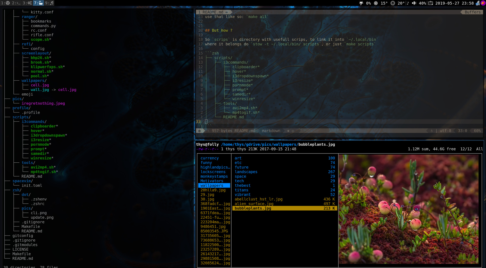

# CARBS

Chad Arch Random Bootstrap Scripts, and also dots.



## Install CARBS dots right now

Everything is installed using `stow`. The `Makefile` knows how to use it, so
use that like so: `make -B all`, thats all.


## stow shenanigans

So `scripts` is a directory with usefull scrips. To link `scripts/tools` into
`~/.local/bin` where it belongs, do `cd scripts; stow -t ~/.local/bin/ tools`, or just
`make scripts`, which will do it for both `i3commands` and `tools`.

So this tree will be linked into `~/.local/bin`

```zsh
├── scripts/
│   ├── i3commands/
│   │   ├── clipboarder*
│   │   ├── hover*
│   │   ├── i3dropdownspawn*
│   │   ├── i3resize*
│   │   ├── pornmode*
│   │   ├── prompt*
│   │   ├── samedir*
│   │   └── winresize*
│   ├── tools/
│   │   ├── avi2mp4.sh*
│   │   └── mp4togif.sh*
│   └── README.md

```

## Desktop fed on moist and delightfull CARBS


